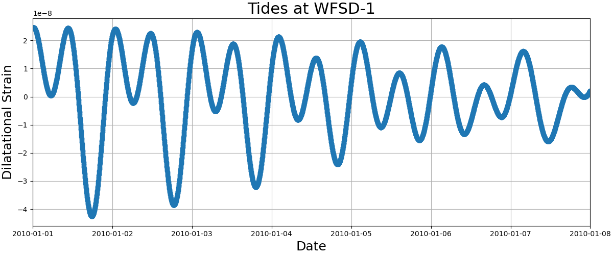

# Estimating permeability at the HSDP from well response to tidal strain

## Description

This repository contains several scripts to estimate permeability using the response of wells to tidal strain.  We first attempt to reproduce the results of Xue et al. 2013 and then apply the same procedure to well data and tidal timeseries from the Hawaii Scientific Drilling Project borehole near Hilo, HI.  Maybe one day I/we will publish this and, if we do, you can cite the paper below if you find the scripts useful:

Thomas, A. M., and D. J DePaolo (2021) Calculating permeability in Hawaii.

BibTeX:

    @article{thomas2021hp,
        title={Calculating permeability in Hawaii},
        author={Thomas, Amanda M and D. J. DePaolo},
        journal={Who knows},
    }

## Requirements

In order to run the scripts you will need Python and basic packages such as Numpy and Scipy.  I recommend creating a [conda](https://docs.conda.io/en/latest/) environment and installing both packages into it.  You will also need to install [SPOTL](https://igppweb.ucsd.edu/~agnew/Spotl/spotlmain.html) to run the script that requires ertid.  

## Reproducing Xue et al. (2013)

### Step 1: Calculate the tides for WFSD-1 

Since WFSD-1 is far from the ocean I used only ertid (body load only) to calcuate the tides at the location listed in the paper (31.1°N, 103.7°E).  I calulated them for two years starting on 1/1/2010 with a sampling rate of two minutes using the script **for\_wenchuan.sh**.  This creates a file called xue_tides_2021 that has the north strain in column 1 and the east strain in column 2.  The times from SPOTL are in UTC--this will be important later.  To get the tidal dilatation we add the east and north strain and the units are in nanostrain.  The calculated dilatation is shown in Figure 1 below.

